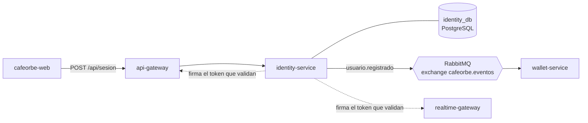
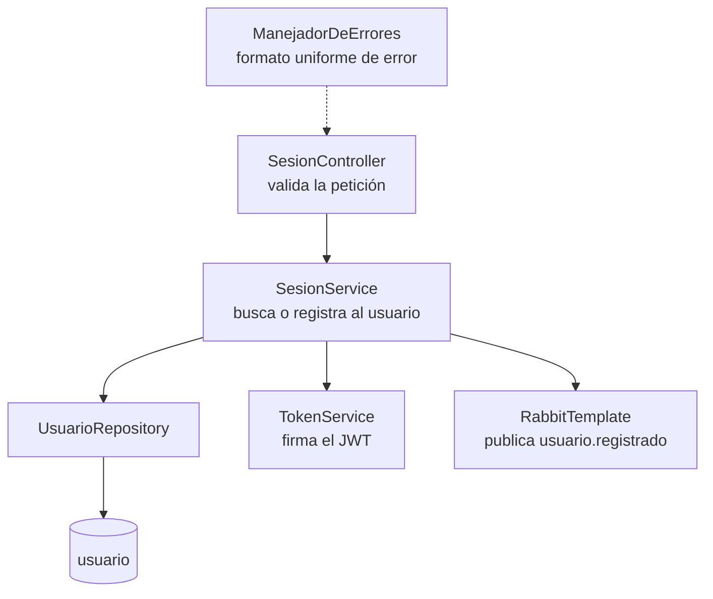
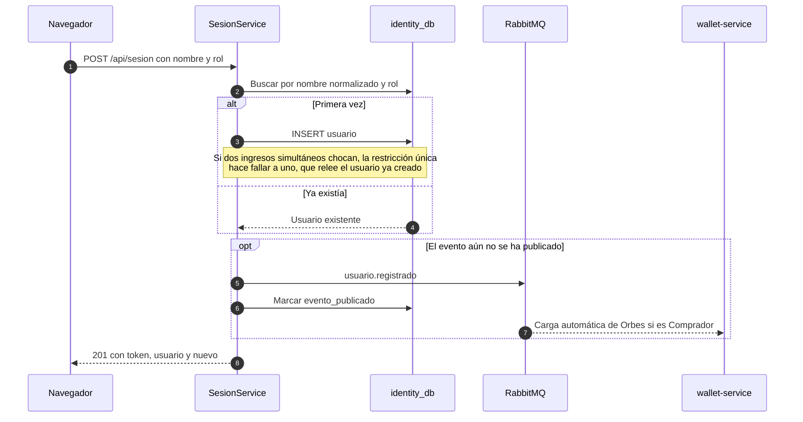
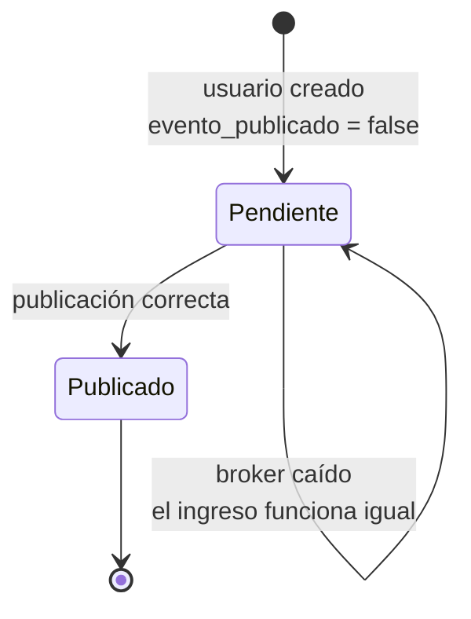
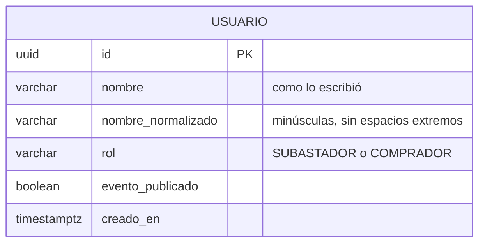
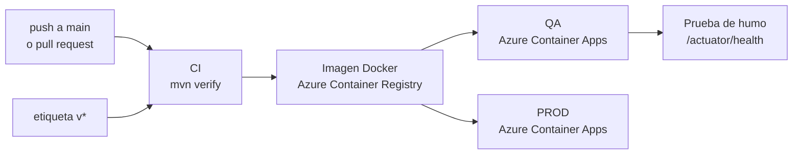

# cafeorbe-identity-service

> Emite la sesión de CaféOrbe: recibe un nombre y un rol, registra a la persona la primera vez y entrega el token con el que el resto del sistema la reconoce.

| | |
|---|---|
| **Responsabilidad** | Crear la sesión y emitir el token de identidad |
| **Estilo interno** | CRUD en capas (Controller → Service → Repository) |
| **Stack** | Java 21 · Spring Boot 3.5 · Spring Data JPA · Flyway · JJWT · RabbitMQ |
| **Persistencia** | PostgreSQL, base propia `identity_db` |
| **Puerto** | `8081` |
| **Historias** | HU-01, HU-02 y el origen de HU-07 |
| **Publica** | `usuario.registrado` |
| **Depende de** | Ningún otro servicio |

## Contenido

1. [Contexto](#1-contexto)
2. [Arquitectura interna](#2-arquitectura-interna)
3. [Contrato de la API](#3-contrato-de-la-api)
4. [Flujo de inicio de sesión](#4-flujo-de-inicio-de-sesión)
5. [El token de sesión](#5-el-token-de-sesión)
6. [Publicación del evento](#6-publicación-del-evento)
7. [Modelo de datos](#7-modelo-de-datos)
8. [Decisiones de arquitectura](#8-decisiones-de-arquitectura)
9. [Atributos de calidad](#9-atributos-de-calidad)
10. [Configuración](#10-configuración)
11. [Ejecución y pruebas](#11-ejecución-y-pruebas)
12. [Despliegue](#12-despliegue)
13. [Riesgos conocidos y evolución](#13-riesgos-conocidos-y-evolución)

---

## 1. Contexto



El servicio tiene una sola entrada (crear la sesión) y dos salidas: el **token**, que el api-gateway y el realtime-gateway validan sin volver a consultarlo, y el evento **`usuario.registrado`**, con el que wallet-service asigna los Orbes iniciales a un Comprador nuevo.

## 2. Arquitectura interna

Dos historias sin reglas complejas. Un modelo simple en tres capas es suficiente; un modelo de dominio rico aquí sería sobreingeniería.



| Capa | Paquete | Contenido |
|---|---|---|
| Entrada | `controller` | `SesionController`, validación de la petición, `ManejadorDeErrores` |
| Lógica | `service` | `SesionService` (buscar o registrar), `TokenService` (firma) |
| Datos | `repository`, `model` | `UsuarioRepository`, entidad `Usuario` |
| Configuración | `config` | Exchange y conversor JSON de RabbitMQ |

## 3. Contrato de la API

### `POST /api/sesion`

Único endpoint. Es público: el api-gateway lo deja pasar sin token.

```json
// Petición
{ "nombre": "Ana", "rol": "COMPRADOR" }

// Respuesta 201
{
  "token": "eyJhbGciOiJIUzI1NiJ9...",
  "usuario": { "id": "0b6f...", "nombre": "Ana", "rol": "COMPRADOR" },
  "nuevo": true
}
```

| Campo | Regla |
|---|---|
| `nombre` | Obligatorio, máximo 50 caracteres |
| `rol` | `SUBASTADOR` o `COMPRADOR` |
| `nuevo` | `true` solo la primera vez que esa persona ingresa. El frontend lo usa para avisar de la carga automática de Orbes |

| HTTP | Cuándo | Mensaje |
|:-:|---|---|
| `201` | Sesión creada | |
| `400` | Nombre vacío | El nombre es obligatorio |
| `400` | Rol ausente | El rol es obligatorio |
| `400` | Rol desconocido o cuerpo ilegible | La solicitud no es válida: revisa el nombre y el rol |

**Cerrar sesión (HU-02) no tiene endpoint:** el cliente descarta el token. El servidor no guarda sesiones.

## 4. Flujo de inicio de sesión



**Identidad de una persona:** nombre sin distinguir mayúsculas ni espacios en los extremos, más el rol. "Ana" y " ana " como Comprador son la misma persona; "Ana" como Subastador es otra.

## 5. El token de sesión

Un JWT firmado con HS256. Lo validan el api-gateway (peticiones REST) y el realtime-gateway (conexión WebSocket) con el mismo secreto.

| Claim | Contenido |
|---|---|
| `sub` | Id del usuario (UUID) |
| `nombre` | Nombre para mostrar |
| `rol` | `SUBASTADOR` o `COMPRADOR` |
| `iat` / `exp` | Emisión y vencimiento: 8 horas |

El token es **autocontenido**: quien lo valida no necesita consultar a este servicio. Por eso identity puede estar caído sin afectar a los usuarios que ya ingresaron.

## 6. Publicación del evento

El evento `usuario.registrado` es lo que dispara la carga inicial de Orbes, así que no puede perderse.



- La bandera `evento_publicado` vive en la misma fila del usuario. Mientras sea `false`, **cada nuevo ingreso reintenta la publicación**.
- Un reintento genera un evento con otro `eventId`. No hay doble carga porque wallet-service es idempotente por usuario.
- Si el broker falla, el inicio de sesión **no falla**: el usuario entra y la carga de Orbes llega cuando el evento logre salir.

## 7. Modelo de datos



Restricción única sobre `(nombre_normalizado, rol)`. El esquema lo gestiona Flyway; Hibernate solo valida.

## 8. Decisiones de arquitectura

| Decisión | Motivo | Costo aceptado |
|---|---|---|
| Acceso solo con nombre y rol, sin contraseña | Es lo que pide HU-01: el MVP busca entrar rápido a una demo de subasta | Cualquiera puede ingresar con el nombre de otra persona |
| Token autocontenido sin sesiones en servidor | Los validadores no dependen de este servicio y escalar no requiere estado compartido | No se puede revocar un token antes de que venza |
| Bandera `evento_publicado` en lugar de una tabla outbox | Hay un solo evento por usuario; una bandera en su propia fila cubre el caso con mucho menos código | El reintento ocurre solo cuando el usuario vuelve a ingresar |
| El rol va como texto en el evento | El contrato no acopla a los consumidores a una enumeración de Java | El consumidor compara cadenas |
| CRUD anémico | No hay reglas de negocio que proteger | Si aparecen reglas (bloqueos, perfiles), habrá que mover lógica al modelo |

## 9. Atributos de calidad

| Atributo | Cómo se logra |
|---|---|
| **Disponibilidad** | El ingreso funciona aunque RabbitMQ esté caído |
| **Consistencia** | Restricción única en base de datos como árbitro de los ingresos simultáneos |
| **Escalabilidad** | Sin estado en memoria: cualquier instancia atiende cualquier petición |
| **Seguridad** | Token firmado y con vencimiento; el secreto se inyecta por variable de entorno |
| **Operabilidad** | `GET /actuator/health` |

## 10. Configuración

| Variable | Por defecto | Uso |
|---|---|---|
| `DB_URL` `DB_USER` `DB_PASSWORD` | `jdbc:postgresql://localhost:5432/identity_db` | Base de datos propia |
| `RABBIT_HOST` `RABBIT_PORT` `RABBIT_USER` `RABBIT_PASSWORD` | `localhost:5672` | Broker de eventos |
| `RABBIT_VHOST` `RABBIT_SSL` | `/` · `false` | Broker gestionado con TLS |
| `JWT_SECRET` | valor de desarrollo | Mínimo 32 caracteres. Debe ser el mismo en api-gateway y realtime-gateway |

## 11. Ejecución y pruebas

Requiere **Java 21** y el módulo `cafeorbe-contracts` instalado (`mvn install` en ese repositorio).

```bash
mvn spring-boot:run      # necesita Postgres y RabbitMQ: ver cafeorbe-infra
mvn test                 # 6 pruebas con H2 en memoria: no necesita infraestructura
```

Las pruebas (`SesionApiTest`) cubren los tres escenarios de HU-01, el rol inválido, el segundo ingreso sin republicar el evento y el reintento cuando el broker estaba caído.

## 12. Despliegue



El pipeline (`.github/workflows/ci.yml`) despliega en QA con cada cambio en `main` y en PROD con una etiqueta `v*`. La prueba de humo reintenta hasta 3 minutos porque el arranque del servicio tarda entre 60 y 90 segundos.

## 13. Riesgos conocidos y evolución

| Riesgo o deuda | Impacto | Acción propuesta |
|---|---|---|
| Sin autenticación real | Suplantación trivial: basta conocer el nombre | Aceptado para el MVP. Para producción: contraseña o proveedor de identidad externo (OIDC) |
| Evento pendiente si el usuario no vuelve | Un Comprador que ingresó con el broker caído no recibe Orbes hasta su próximo ingreso | Tarea periódica que publique los pendientes, u outbox como en auction |
| Token sin revocación | Un token robado sirve hasta 8 horas | Tokens de vida corta con renovación |
| Secreto simétrico compartido | Tres servicios podrían emitir tokens válidos | Firma asimétrica: solo identity tiene la clave privada |
| QA y PROD comparten base de datos y broker en el pipeline | Usuarios y eventos mezclados entre ambientes | Separar bases y vhost por ambiente |
